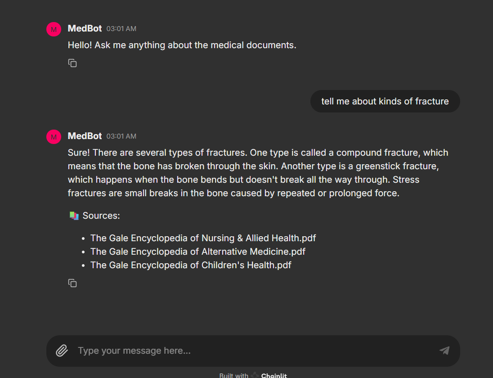

# Medical Chat-Bot

A **Retrieval-Augmented Generation (RAG) chatbot** that answers medical questions using a collection of medical reference books.  
The system combines **vector search, a local language model, and conversational memory** to provide contextual answers with source references.

## Features

- Conversational medical question answering
- FAISS-based vector search over medical books
- Local LLM inference using HuggingFace Transformers
- Redis-powered conversational memory
- Interactive chat UI using Chainlit
- Containerized deployment using Docker


## Demo





## Architecture

```
        User
        │
        ▼
        Chainlit Chat UI
        │
        ▼
        FastAPI Backend
        │
        ▼
        RAG Pipeline
        ├─ Query Rewriting (History-aware retrieval)
        ├─ FAISS Vector Search
        ├─ Context Injection
        └─ Local LLM Generation
        │
        ▼
        Redis Memory
```

## Project Structure

```
        Medical-ChatBot
        │
        ├── app
        │   ├── api
        │   │   └── routes.py
        │   │
        │   ├── rag
        │   │   ├── rag_pipeline.py
        │   │   ├── retriever.py
        │   │   ├── llm.py
        │   │   └── prompts.py
        │   │
        │   ├── memory
        │   │   └── redis_memory.py
        │   │
        │   ├── vectorDB
        │   │   └── create_vectorDB.py
        │   │
        │   └── UI
        │       └── chainlit_app.py
        │
        ├── data
        │   └── medical books (PDF)
        │
        ├── vectorstore
        │   └── db_faiss
        │
        ├── docker
        │   ├── backend.Dockerfile
        │   └── ui.Dockerfile
        │
        ├── docker-compose.yml
        ├── requirements.txt
        └── README.md
```

## Installation (on GPU)

### Clone the repository
```
git clone https://github.com/yourusername/Medical-ChatBot.git
cd Medical-ChatBot
```
### create environment
```
conda create -n ragbot python=3.10
conda activate ragbot
```
### Install dependencies
```bash
pip install -r requirements.txt
```
### Creating the Vector Database
Place your medical PDFs inside:
`data/`
Then run:
```
python -m app.vectorDB.create_vectorDB
```
This will generate the FAISS index inside:
`vectorstore/db_faiss`
### Running the Backend
```
uvicorn app.main:app --host 0.0.0.0 --port 8000
```
Api endpoint:
`POST /query`
### Running the Chat UI
```
chainlit run app/UI/chainlit_app.py --port 8001
```
Open in browser:
`http://localhost:8001`
## Running with Docker
```
docker compose build
docker compose up
```
## Example Query
```
User: What are symptoms of cancer?

Assistant:
Common symptoms of cancer include fatigue, unexplained weight loss, lumps in the body, persistent cough, changes in bowel habits, and unusual bleeding.
```

## Tech Stack
- Python
- FastAPI
- Chainlit
- LangChain
- FAISS
- HuggingFace Transformers
- Redis
- Docker
- DVC

---