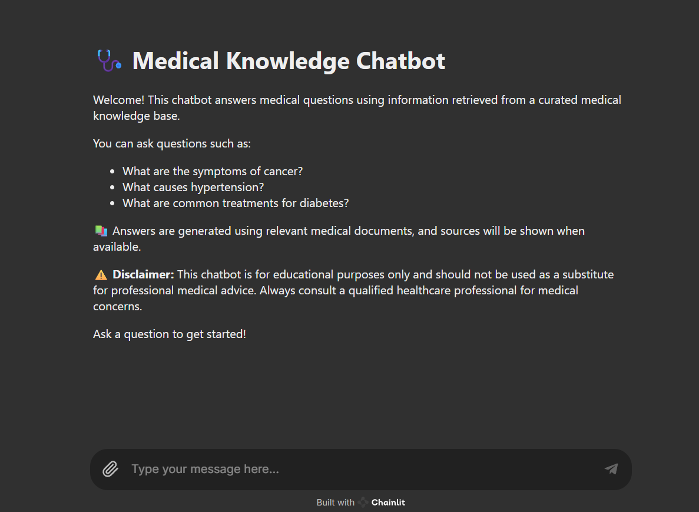

# Medical Chat-Bot

The Medical Bot is a powerful tool designed to provide medical information by answering user queries using state-of-the-art language models and vector stores. 

Before you can start using the Langchain Medical Bot, make sure you have the following prerequisites installed on your system:

- Python 3.6 or higher
- Required Python packages (you can install them using pip):
    - langchain
    - chainlit
    - sentence-transformers
    - faiss
    - PyPDF2 (for PDF document loading)

Run RAG Backend
` uvicorn app.main:app --host 0.0.0.0 --port 8000 `

Start Chainlit
` chainlit run app/chainlit_app.py --port 8001 `

create new faiss vectorDB
` python -m app.vectorDB.create_vectorDB `